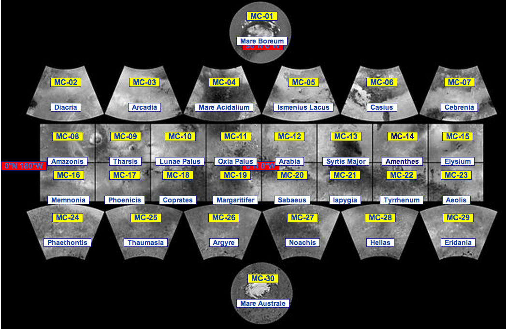

## 火星地理

火星的轨道半径大约 1.5 个天文单位，是一颗跟地球很像的行星，也是人类最早大规模殖民的行星。

### 火星分区表

[美国地质调查局](http://zh.wikipedia.org/zh-cn/%E7%BE%8E%E5%9C%8B%E5%9C%B0%E8%B3%AA%E8%AA%BF%E6%9F%A5%E5%B1%80)（United States Geological Survey，即 USGS）把火星表面分成了 30 个区域，分区的方法是把 360 度的经线分为八份，并且以 0 度、30 度、65 度纬线为界。

（图片来自[维基百科](http://en.wikipedia.org/wiki/Geography_of_Mars#Map_of_quadrangles)。）

### 火星地形

火星的地形早在二十世纪末二十一世纪初的时候就被非常仔细的扫描过。火星全球探勘者号（Mars Global Surveyor, 简称 MGS）的数据被绘制成了火星的完整的地形图：

（来自[维基百科](http://zh.wikipedia.org/wiki/File:PIA02820.jpg)）

（来自[维基百科](http://zh.wikipedia.org/wiki/File:Mars_topography_(MOLA_dataset)_HiRes.jpg)）

### 陨石坑

火星上的陨石坑的命名规则是，大陨石坑以重要的科学家和科幻作家命名；小陨石坑则以地球上的村镇命名。