火星指南
====================


火星的旅游景点非常多，除了奇特的自然景观，被保护起来的人类探测器的遗址、散布在火星各处的前哨战和基地以及壮观的火星城市也都是火星表面旅游的好去处。除此之外，火星的轨道旅游项目中，游客可以乘坐环绕火星的轨道和亚轨道飞行器对火星鸟瞰。

.. admonition:: 指南小助手
   :class: note

   这是一些火星的简要资料索引。

   1. 火星地质图可以参考导览一章的火星地形。:ref:`marsGeo` 。
   2. 火星历法可以参考导览一章的火星历法。 :ref:`marsCal` 。
   3. 火星时间可以参考导览一章的火星计时。 :ref:`marsTimeKeeping` 。


.. figure:: ./resources/marsCities.png
   :align: center

   这是一份截止 2200 年的火星一些重要的探测器遗址和火星城市的地图。


火星自然景观
------------------------


火星美丽的自然景观数不胜数，高山、陨坑、河道、高原，千百种姿态，千百种美丽。


高山，峡谷，陨石坑
~~~~~~~~~~~~~~~~~~~~~~~~~~~~~~~~~~~~~~~~~~~~~~~~~~~~~~~~~~~~~~~~~~~~~


奥林帕斯山——火星最高的山，太阳系第二高峰
```````````````````````````````````````````````````````````````````


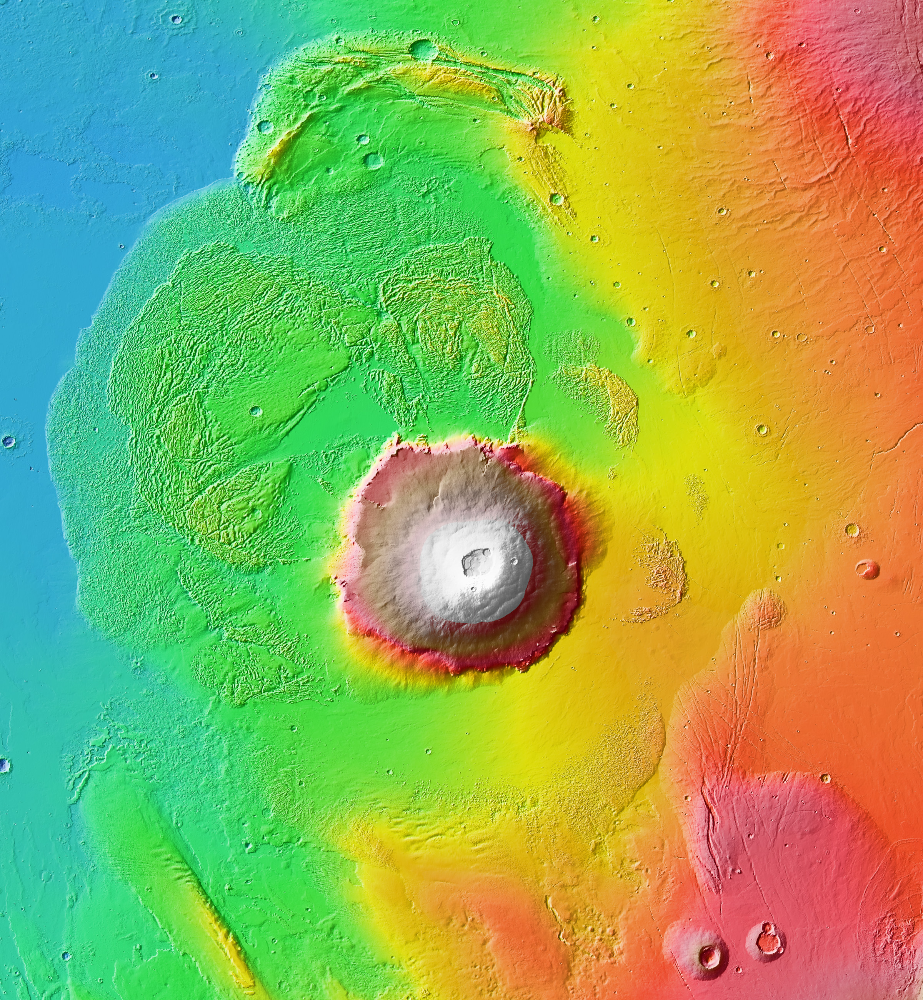

   来自 `Wikipedia:File:Olympus Mons aureole MOLA zoom 64.jpg <http://en.wikipedia.org/wiki/File:Olympus_Mons_aureole_MOLA_zoom_64.jpg>`_ ，公共领域作品


奥林帕斯山是一座火山，面积非常大，山峰非常高。

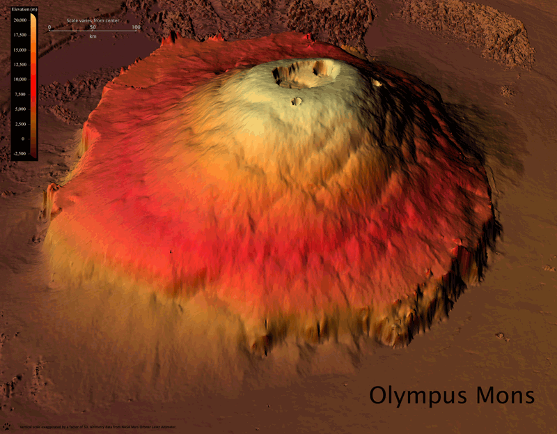

   来自 `HiRISE Mars Digital Elevation Models: Difficult to Build, Easy on the Eye <http://astroengine.com/2008/12/31/hirise-digital-elevation-models-difficult-to-build-easy-on-the-eye/#jp-carousel-2874>`_ 

这样一座壮观宏伟的山，在早上的太阳的照耀下，让人叹为观止：


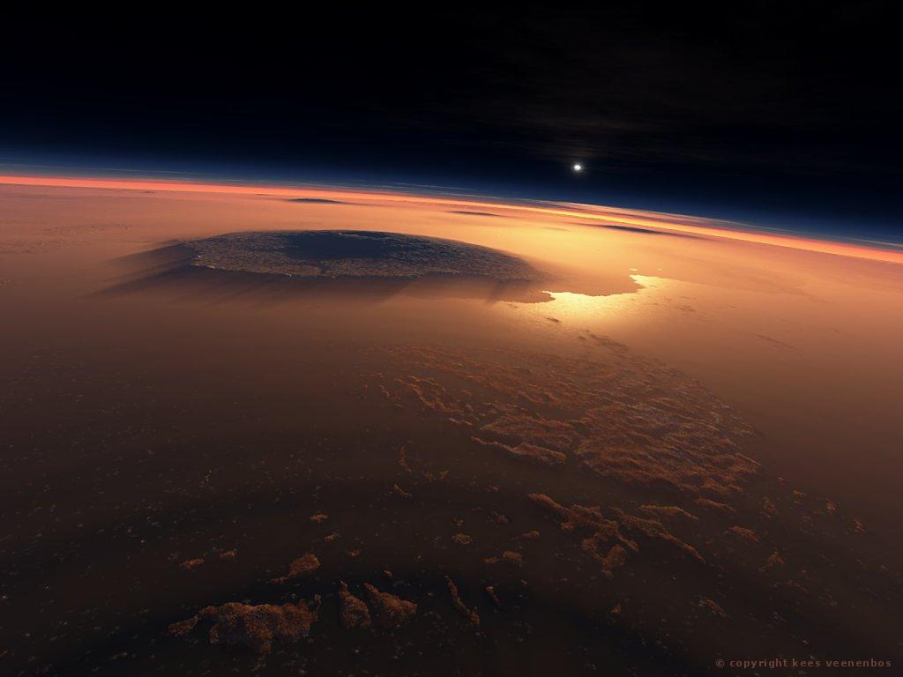

   奥林帕斯山和远处的塔尔西斯山，太阳已经升起，照亮了这四座山峰。（Credit: NASA，JPL）


水手峡谷——火星的伤疤
```````````````````````````````````````````````````````````````````


.. figure:: ./resources/marineO.jpg
   :align: center

   在太空中看到火星，水手峡谷如同火星巨大的伤疤。（来自 `File:Mars Valles Marineris.jpeg <http://zh.wikipedia.org/wiki/File:Mars_Valles_Marineris.jpeg>`_ ，公共领域作品） 

水手峡谷如同火星巨大的伤疤。万籁俱寂的时刻，阳光洒下。

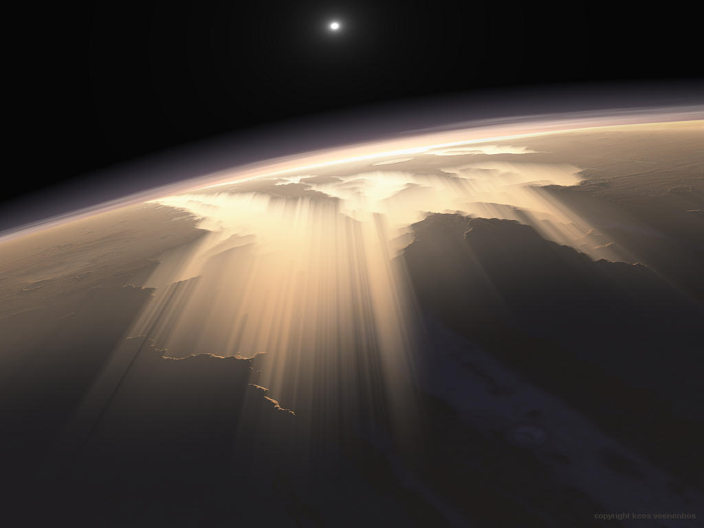

   来自： `Kees Veenenbos <http://www.space4case.com/mmw/pages/space4case/mars/mars-images-2005.php>`_ 


朝阳升起，站在峡谷中，仰望远处的风光。


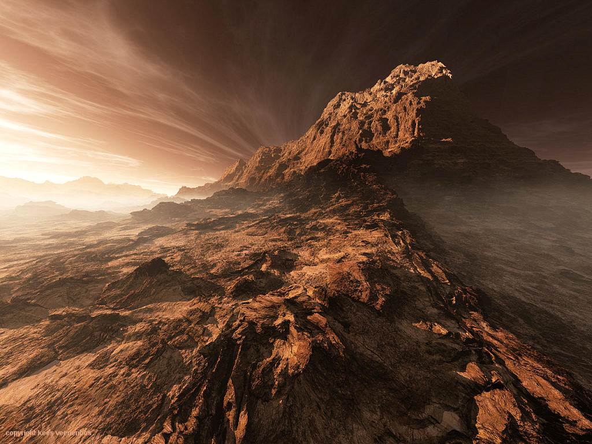

   来自：`Kees Veenenbos <http://www.space4case.com/mmw/pages/space4case/mars/mars-images-2005.php>`_ 


盖尔撞击坑（Gale Crater）——山上的山
```````````````````````````````````````````````````````````````````


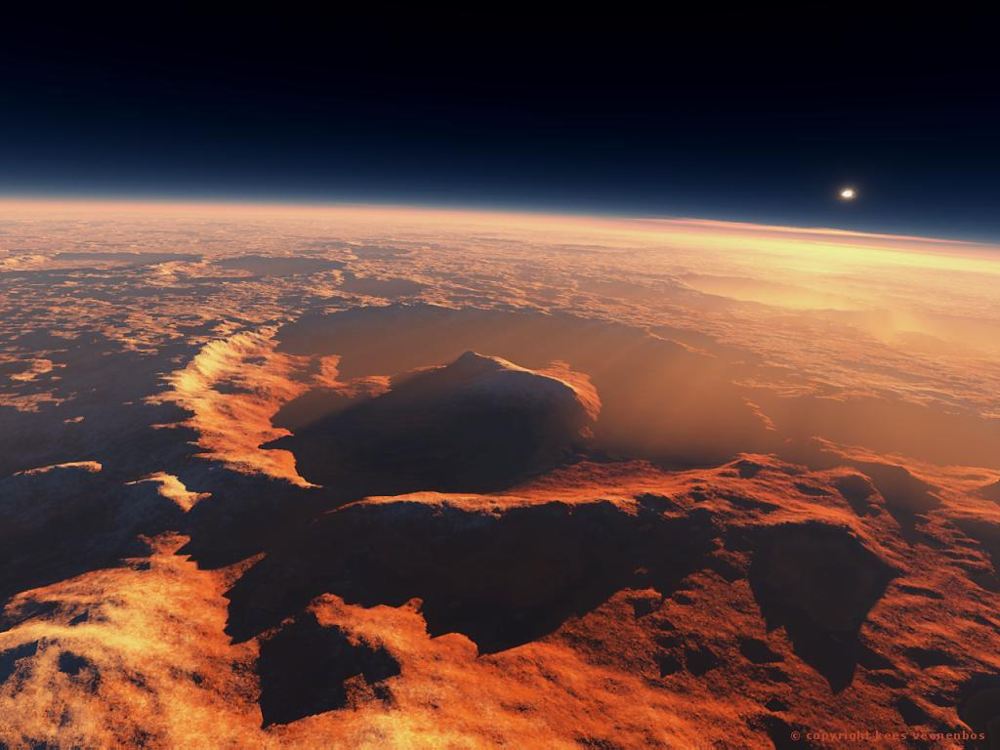

   来自： `Kees Veenenbos <http://www.space4case.com/mmw/pages/space4case/mars/mars-images-2005.php>`_ 


盖尔撞击坑中有着非常神奇的景观：山顶上的山峰。同时也是 `火星科学实验室 <http://zh.wikipedia.org/wiki/%E7%81%AB%E6%98%9F%E7%A7%91%E5%AD%A6%E5%AE%9E%E9%AA%8C%E5%AE%A4>`_ 的着陆地点，也就是好奇号的着陆的地方。由于流水侵蚀，撞击坑内有很多的侵蚀河道，地形复杂。

即便在太空中，也可以轻松辨认出盖尔撞击坑。在漫漫的火星表面，它就像碗里的托着一块小蛋糕。


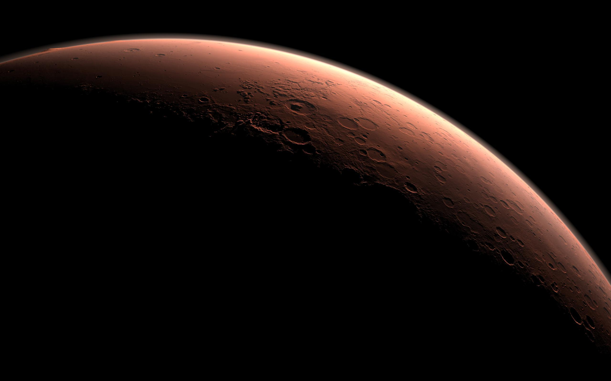

   盖尔撞击坑正要开始一个新的白天。（ `File:Daybreak at Gale Crater.jpg <http://zh.wikipedia.org/wiki/File:Daybreak_at_Gale_Crater.jpg>`_ 公共领域作品）


塔尔西斯山——三颗纽扣
```````````````````````````````````````````````````````````````````


塔尔西斯山由三座盾状火山组成，像三颗纽扣一样装饰在奥林帕斯山一侧。许多旅游者会站在这里，如果遥望女神一样，遥望远处的奥林帕斯山。

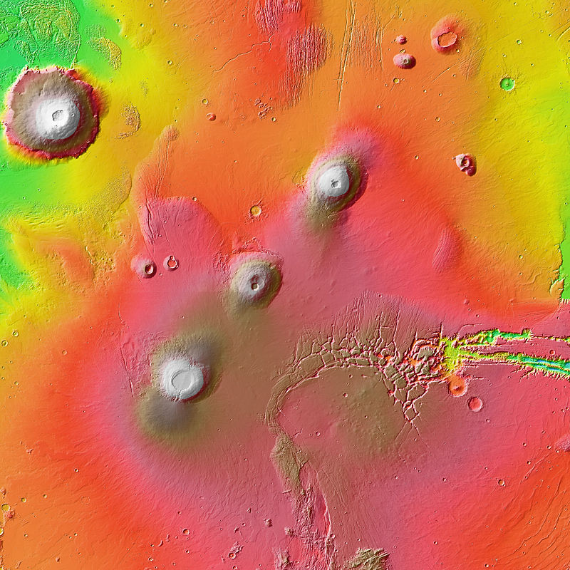

   来自 `Wikipedia File:Tharsis Montes MOLA zoom 64.jpg <http://commons.wikimedia.org/wiki/File:Tharsis_Montes_MOLA_zoom_64.jpg>`_ 公共领域作品


埃律西昂山
```````````````````````````````````````````````````````````````````

埃律西昂山在平坦的火星亚马逊平原上，是非常突兀的一座高山。


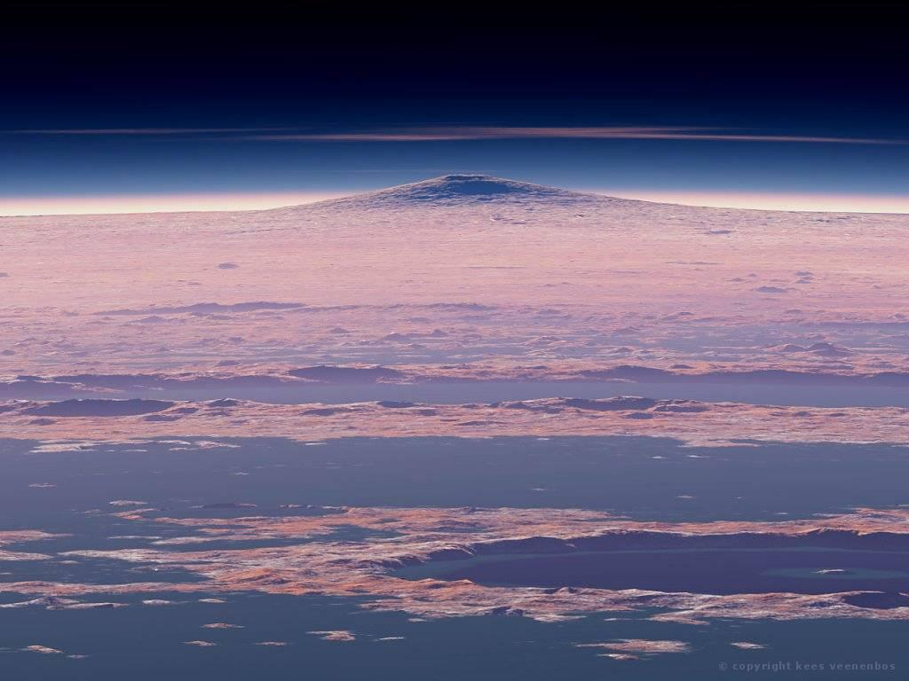

   来自： `Kees Veenenbos <http://www.space4case.com/mmw/pages/space4case/mars/mars-images-2005.php>`_ 


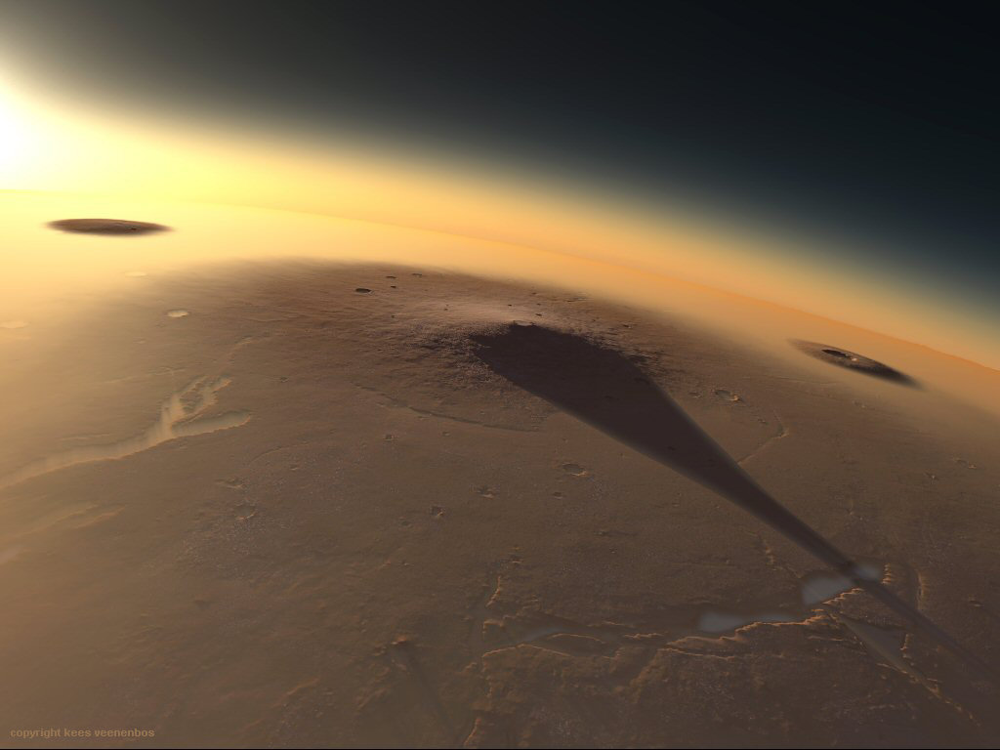

   埃律西昂山上太阳升起。（来自： `Kees Veenenbos <http://www.space4case.com/mmw/pages/space4case/mars/mars-images-2005.php>`_ ） 


日出，日落，日食
~~~~~~~~~~~~~~~~~~~~~~~~~~~~~~~~~~~~~~~~~~~~~~~~~~~~~~~~~~~~~~~~~~~~~~~~~~~

火星上的日出日落，有时候会出现一些奇特景象。


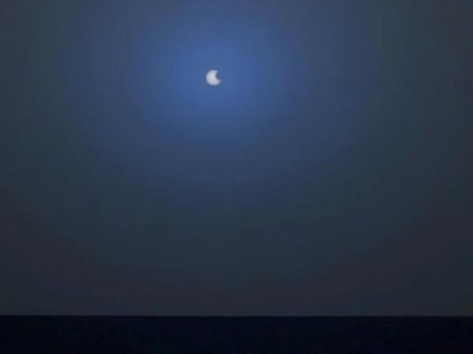

   火星的蓝色日落。由于火星大气中颗粒的作用，火星的日落会出现不同的颜色，例如上面的蓝色。不同的天气状况会出现不同的日落，除了蓝太阳，也会有红色的日落。


地球上的日食，是个奇观。然而火星上的日食，也有其特别之处。

.. figure:: ./resources/PIA17356-MarsCuriosityRover-EclipseOfSunByPhobos.jpg
   :align: center

   好奇号拍摄到的火星上的“日食”。（ 来自 `Wikipedia File:PIA17356-MarsCuriosityRover-EclipseOfSunByPhobos.jpg <http://commons.wikimedia.org/wiki/File:PIA17356-MarsCuriosityRover-EclipseOfSunByPhobos.jpg>`_ ）


.. admonition:: 补充知识
   :class: note

   火星有两颗卫星，火卫一 Phobos 和火卫二 Deimos，他们都很小，半径分别有 11 千米多点和不到 7 千米。两颗卫星公转周期都非常短，Phobos 只要 7 个半小时多点就绕火星一圈，而 Deimos 也只要 30 小时。所以火星上日食是经常发生的。只是由于两颗卫星比较小，形状不规则，不会像地球这样发生完美的日全食，发生日食的地点也有限。


   火星上的卫星 Phobos 遮挡太阳的场景。（来自 `NASA: Martian Moon Blocks Sun  <http://photojournal.jpl.nasa.gov/catalog/PIA05553>`_ ）


