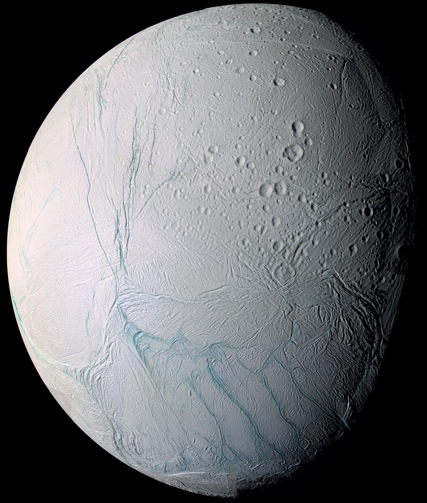

土星系统其他指南
=================

土星是一颗非常美丽的行星，巨大的光环环绕这颗巨大的气态行星。光照洒在薄薄的光环上，如梦如幻。

土星系统有很多卫星，比较著名的卫星有土卫六（泰坦，Titan）和土卫二（恩克拉多斯，Enceladus）。

土卫二
---------------------

   太空中遥望土卫二，可以看到表面杂乱的条纹。这是卡西尼拍摄的照片，来自 `Fresh Tiger Stripes on Enceladus @ NASA <http://solarsystem.nasa.gov/multimedia/display.cfm?Category=Planets&IM_ID=11624>`_ 。

土卫二是一个冰层覆盖的卫星，在冰层之下几十米的地方，就是我们需要的液态水，虽然其海洋的 pH 值达到了 11 到 12。[phEnceladus]_

游客常去观望土卫二南极，因为这里有细小的冰颗粒喷出，一直延伸到太空之中。[iceEnceladus]_

.. [phEnceladus] `arXiv:1502.01946, The pH of Enceladus' ocean <http://arxiv.org/abs/1502.01946>`_
.. [iceEnceladus] `Fresh Tiger Stripes on Enceladus  <http://solarsystem.nasa.gov/multimedia/display.cfm?Category=Planets&IM_ID=11624>`_