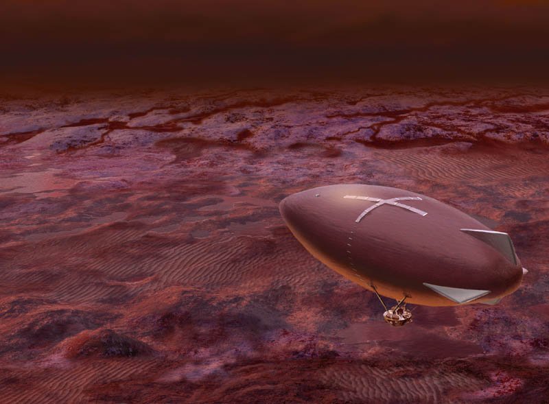

泰坦指南
====================

这是一个大气压远远高于地球表面大气压的地方，走在泰坦上，跟在地球上五米深的水下走路差不多，因此多数泰坦旅行项目都是通过飞艇观光的。泰坦上常年有橙色的雾气和厚厚的云层。

   泰坦上的飞艇。（来源 `Titan Aerobot <http://stock-space-images.com/saturnpage.html>`_ ，原作者仅开放教育用途使用。）

泰坦上的很多极限飞行项目很热门，然而很多区域人工驱散了云层和雾气，加热了空气，提供各种各样的飞行运动，例如翼装飞行。泰坦上常年都有各种极限运动的竞赛。

当然，最重要的是，天气好的日子中，可以看到更加壮观的土星光环。

泰坦自然景观
------------------

象头神——黑暗之山
~~~~~~~~~~~~~~~~~~~~~~~~~~~~~~~~~~~~

这是一个由黑暗物质组成的山。

.. figure:: resources/titan/Ganesa-Titan.jpg
   :align: center

   象头神。（来源 `Titan Aerobot <http://stock-space-images.com/saturnpage.html>`_ ，原作者仅开放教育用途使用。）