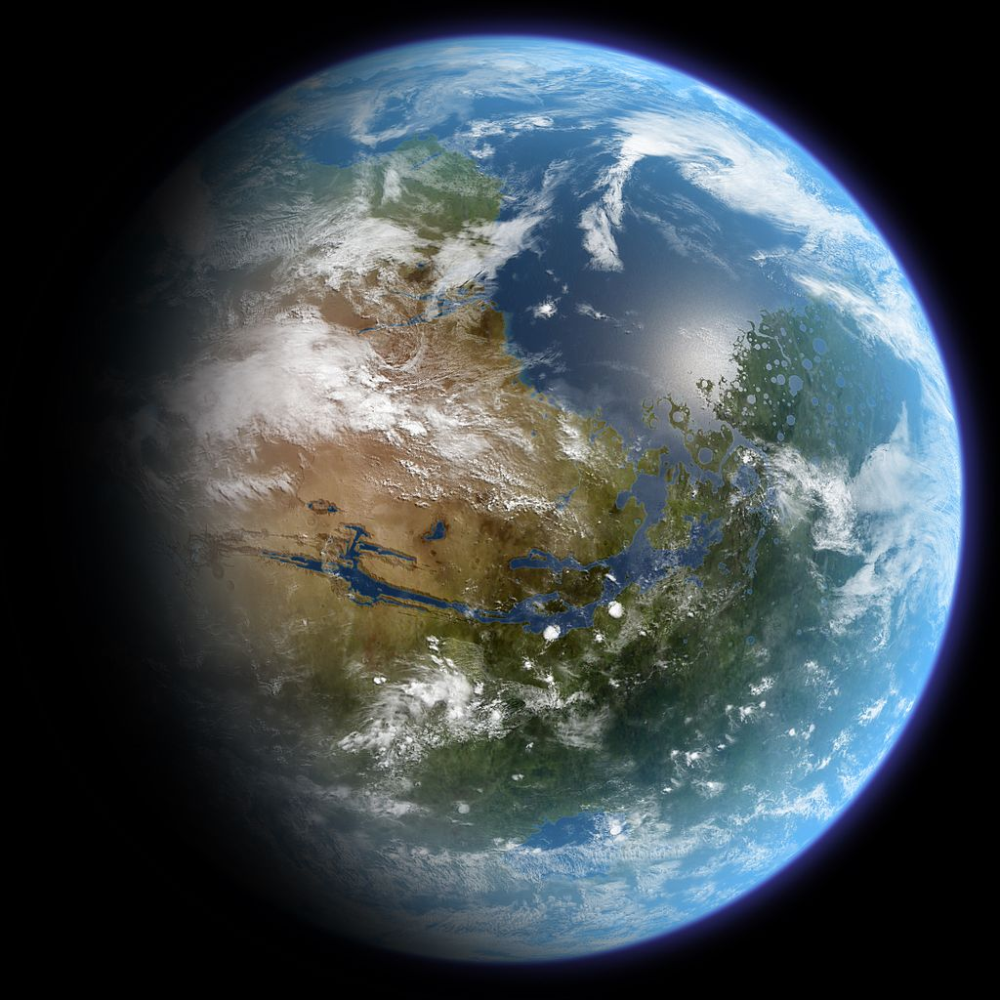

火星地球化
=====================

2213 年，星际移民局第一次呼吁地球协助火星进行地球化工作，但是地球各大势力团体和政治机构都持观望的态度。经过两年的努力，星际移民局既没有得到地球提供的任何技术支持，也说服任何机构部门提供资金支持。这次活动以完全失败告终。2216 年，星际移民局第二次发布合作消息，并且进行了很多宣传和动员工作，得到的依然是地球各方面的冷淡反应。然而在 2218 年，星际移民局还是联合多家公司企业启动了第一期工程。但这是星际移民局主导并完整投资，各大相关利益的公司、商会参与竞标的长期工程。

在之前的多项实验之后，星际移民局确立了一个称为火星家园的远景计划，整个计划通过三期工程来完成。三期工程的主题分别是大气改造、植被建立和生态多样化。大气改造采用多种方式结合的方案，包括火星地面空气工厂生产温室气体、火星自身储存温室气体的释放和火星外的温室气体运输，这些方案同时进行。之后采用基因改造的植物用于火星表面植被的建立，建立非常初步的生态循环。最后按照多种模拟的结果来进行生态多样化。

第一期工程正式启动其实是在 2219 年。经过协商，艾娃火星和泰坦金刚以及几家小公司参与建设的土卫六空气采集站、土卫六水冰采集站、土卫六液氨合成站开始大规模建成，UPI 合作的液氨的大规模运输系统也在先前实验基础上建立起来。与此同时，星际移民局设计制造的大型氢弹和轨道上的改造的太阳帆也用于极冠的二氧化碳和水汽的释放，其中太阳帆大多使用先前用于物资运输的太阳帆飞船改造而来。

第一期工程进行了近 60 年才完成，中间经历过中断，也经历过计划的升级，但是火星大气初步改造最终达到了最初设立的目标。随之而来的第二期工程的逐渐进入工程主体，这是天际园和蔚蓝基因主导实施的工程。天际园和蔚蓝基因具有非常成熟和当时最先进的基因改造和评估技术，虽然他们的核心技术不同，长期的实践证明都是安全有效的。在第一期工程完成之前基因改造的植物经过实验室安全性鉴定和火星模拟环境测试，被大规模种植在特定的区域。

.. figure:: resources/MarsTransitionV.jpg
   :align: center

   火星地球化过程。来源：`Mars Transition <https://commons.wikimedia.org/wiki/File:MarsTransitionV.jpg>`_ CC BY-SA 协议。

第二期工程实施的中后期，也就是 24 世纪初期，人们已经可以短暂地呼吸火星空气。在 2422 年，火星生态补全计划启动，由蔚蓝基因主导，此时二期工程尚未完全完工，这时三期工程只是非常小规模的实施中。直到 2467 年，生态多样化计划才正式大规模启动，而二期工程在前三年即 2464 年正式结束，此时火星空气已经。此时和韵生态加入到工程中，开始起到关键作用。

2462 年，火星空气已经达到了星际移民局的健康标准。之后的三期工程启动之后，增加了生态系统的复杂性和稳定性。

   改造的火星。来源：`Terraformed Mars Globe Realistic <https://commons.wikimedia.org/wiki/File:TerraformedMarsGlobeRealistic.jpg>`_ CC BY-SA 协议。

