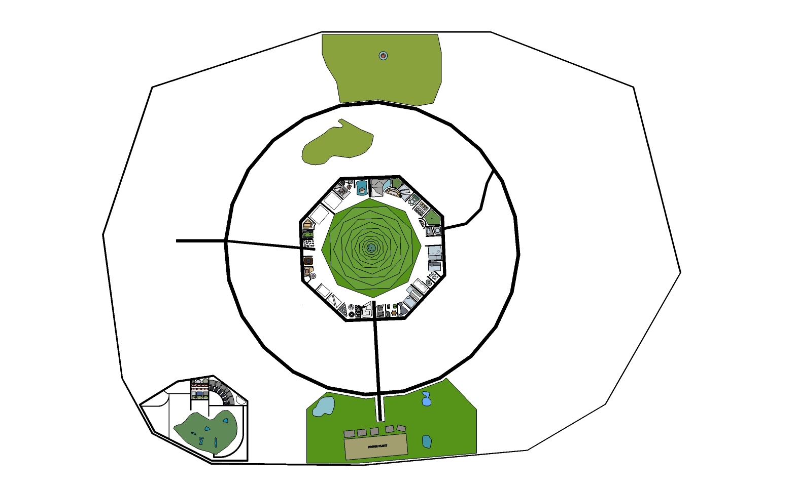

星际移民中心
=================

星际移民中心的总部接待处目前设置在火星，坐落在星际移民局的巨型建筑内。

如果您目前位于地球，需要乘坐相应航线到达火星，然后选择合适的交通方式到达南河城，星际移民局总部就在南河城的中心。

   火星南河城主要建筑和路线图。中间的巨型建筑就是星际移民局总部所在。

由于火星伊希地的三座城市（南河城、参宿城和天狼城）相距不远，因此可以在这三个城市中任何一个降落，然后通过地面或者空中交通抵达南河城。

.. figure:: http://interimm.org/assets/img/marsCities.png
   :align: center

   这是火星的地图。如有疑问请咨询本中心。`互动版地图在此 <http://interimm.org/mars-map/>`_。

抵达星际移民局总部之后，在任意一个自动问询处都可以呼叫到自动导航车，自动导航车会带您到达建筑内任何目的地。

另外，可以在南河城的联合运输站乘坐列车二号线，在“星际移民中心站”下车，在车站出口处便会看到多种语言的“星际移民中心”的标识。您同样可以使用此处的自动导航车。如果是在工作日，也可以在出口处的咨询台询问，星际移民中心的工作人员会提供帮助。
