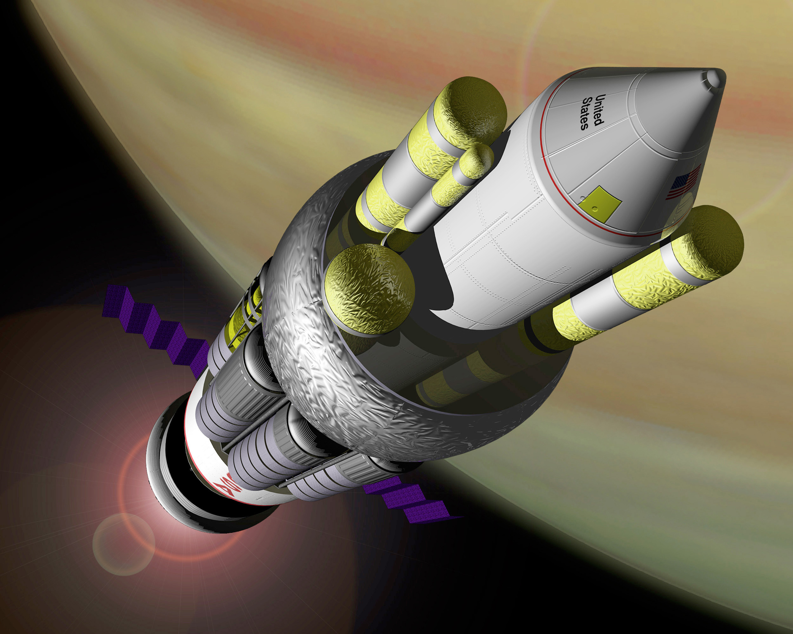

推进技术
=================

.. _interTrans:

行星际运输
---------------------

.. index:: 地火运输

.. _earth2mars:

地火运输
~~~~~~~~~~~~~~~~~~~~~

.. index:: 太空拖车

.. _spaceTug:

太空拖车
^^^^^^^^^^^^^^^^^

在第一个火星前哨站建立之后，UPI 的大宗货物运输是通过霍曼转移轨道进行的。由于当时在这种运输方式上的经验比较丰富，此方式被使用了多年。后来被称为“太空海运”，由于运输周期长，被人戏称为“太空拖车”。

.. figure:: resources/hohmannSystem.png
   :align: center
   :width: 400
   :alt: 霍曼转移轨道

运输器采用了大量的太空集装箱式的货仓设计，扩展方便。在 ULA 加入到火星殖民地建设中来之后，这部分逐渐完全转交给 ULA 负责。

.. _interBallistic:

星际弹道捕获
^^^^^^^^^^^^^^^^^^^

弹道捕获的最早使用可以追溯到二十世纪人类发射的月球探测器 `Hiten <https://en.wikipedia.org/wiki/Low-energy_transfer#History>`_ 。通过这种方式到达环绕火星的轨道所需要的能量要比霍曼转移轨道的能量要低，然而也需要更长的时间。这种运输方式更加节省燃料，也就意味着同样的燃料可以运送更多的货物。在传统化学火箭时代，这种轨道是一种比霍曼转移轨道还要价格低廉，因此也长期存在。甚至在热核火箭和离子推进技术兴起的时代，这种运输轨道也被许多不知名的小机构继续使用。

轨道在前期与霍曼转移类似，然而通过霍曼转移并非直接到达火星，而是到达火星轨道之内的某处，然后采用一个弹道捕获的轨道慢慢地与火星会和。

.. figure:: resources/history/BallisticCaptureTransferStructure0.png
   :align: center
   :alt: 弹道捕获的星际转移轨道

   弹道捕获的星际转移轨道。从地球出发，到达火星轨道之内的某处 :math:`x_c` 。参考 `arXiv:1410.8856 <http://arxiv.org/abs/1410.8856>`_ 。

.. figure:: resources/history/BallisticCaptureTransferStructure.png
   :align: center
   :alt: 弹道捕获过程

   从 :math:`x_c` 处到达火星的过程。参考 `arXiv:1410.8856 <http://arxiv.org/abs/1410.8856>`_ 。

.. _express:

快速合点运输
^^^^^^^^^^^^^^^^^

飞船采用快速的合点轨道前往目的地。虽然这需要更多的燃料，但是对于一些需要快速运输而且贵重的货物来说，这是最佳选择。UPI 还在很多小行星设立中转站，负责从地球出发的飞船的安全和紧急补给。

.. index:: 星际弹射系统

.. _massDriver:

星际弹射系统
^^^^^^^^^^^^^^^^^

小型物资的交换，需要比两年更小的周期。IIA 的研发部不得不考虑更加快捷的物质传输方式——星际弹射系统。

星际弹射系统的前身就是在 21 世纪 60 年代的电磁投射系统。在火星殖民开始前的准备中，IIA 已经将一个电磁投射器发射到了火星。在大规模的地面建设开始之后，工程船将绕火星轨道上的电磁投射器进行了改造和更新，建立了更加复杂精确的弹射系统，用来接收地球轨道或者小行星矿场直接弹射过来的物资。经过严密的计算之后，地球轨道上或者位于小行星矿场的的弹射系统会将物资弹出，经由一条较快的路径到达火星，轨道修正由货仓上的离子引擎完成。物资到达火星轨道后，位于火星轨道的弹射系统将为物资减速，进一步空降到地面殖民地。为了全程追踪，每个包裹都会装有唯一标识的无线电信号源。

.. index:: 星际快车

这类弹射系统后来演化为轨道加速器，也就是火星大规模移民的主要交通方式，被称为 **星际快车** 。

.. _contThrust:

持续推进轨道
^^^^^^^^^^^^^^^^^^^

在太阳帆、离子推进和热核火箭兴起之后，地球-火星之间有了快速安全的航线。得益于新的推进技术的发展，这种轨道采用了更加直接的方案飞往目标行星。

.. figure:: resources/history/ionThrustTrajectory.png
   :align: center
   :alt: 地球火星快速航线

   地球和火星之间的快速航线。整个过程中发动机几乎全程开机，直接飞往目标行星。参考： `VASIMR Human Mission to Mars  <http://www.adastrarocket.com/Andrew-SPESIF-2011.pdf>`_ 。

.. index:: 横跨轨道加速器
.. index:: Transorbital Accelerator

.. _TOA:

横跨轨道加速器（TOA）
~~~~~~~~~~~~~~~~~~~~~~~~~~~~~~~~~~~~~~~~

在太阳系内行星之间的运输是通过横跨轨道终端来实现的。横跨轨道终端是一个加速器，可以将飞船在短时间内加速到行星际飞行的速度，这样节省了飞船自身的燃料，对于小型飞船来说，这是非常有效的方式。

例如，星际移民局总部在火星，常常需要快速的在地球和火星之间飞行，对于小型飞船来说，这是非常困难的，所以星际移民局在火星和地球分别建立了横向轨道跳跃装置。

小型飞船通过在火星的终端进行加速，可以达到非常高的速度，这样就可以迅速离开火星飞往地球，经过路途中的几个路径修正和最终靠近地球的减速终端，小型飞船就可以在不消耗自身燃料的情况下快速飞往地球。

.. _interShip:

星际飞船
-----------

在星际移民早期，主要使用的是化学火箭。后来由于核动力等离子火箭的大量使用，移民的成本大大降低，自由移民也开始大量出现。之后，曲率推进的大量生产，是的曲速飞船成为太阳系外移民的主要工具。

.. _ionThrust:

离子火箭
~~~~~~~~~~~~~~~~~~~~~~~~~~~~~

离子火箭是利用高压电场将电离后的物质加速并高速喷出来产生推动力的。

.. figure:: http://www.nasa.gov/centers/glenn/images/content/105800main_fs021fig2.jpg
   :align: center

   离子推进

带电的离子在高压电场作用下，可以达到非常高是速度，从而将火箭推向相反的方向。由于离子火箭可以稳定的持续加速，所以适合远距离航行。

.. admonition:: 扩展阅读
   :class: note

   1. `Ion Propulson @ NASA <http://www.nasa.gov/centers/glenn/about/fs21grc.html>`_
   2. `Ion Thruster @ Wikipedia <https://en.wikipedia.org/wiki/Ion_thruster>`_
   3. 早在二十世纪初，NASA 曾经对整个离子推进做过评估

      .. figure:: http://www.grc.nasa.gov/WWW/ion/future/images/futureapps.jpg
         :align: center

.. _nuclearBombRocket:

核爆飞船
~~~~~~~~~~~~~~~

爆炸用来提供推力，基本的原理与化学火箭并无不同，只不过由原来的连续的推力变成了断断续续的推力。

   猎户座飞船的艺术家想象图。图片为公有领域作品。来自 `维基百科 <https://en.wikipedia.org/wiki/File:NASA-project-orion-artist.jpg>`_ 。

特德・泰勒和弗里曼・戴森主持的猎户座计划，就是试图利核爆来把飞船推向太空。由于单位质量的核弹释放的能量很大，所以这种方式要比传统的化学火箭效率要高得多。

在设计和实验的过程中，飞船需要将炸弹一颗一颗排出并引爆，这个过程与可口可乐公司的自动贩售机取可乐的过程类似，实际上这个机制的设计也咨询了可口可乐公司。

.. _nuclearThermalRocket:

热核火箭
~~~~~~~~~~~~~~~~~~

利用核反应堆将气体加热到几千甚至几万度的高温，使气体从发动机高速喷出，这样也可以大大提高火箭燃料的利用率。

.. figure:: resources/tech/nuclearThermalRocket.png
   :align: center

   热核火箭基本原理，燃料经过核反应堆被加热，从发动机高速喷出。图片为 CC BY-SA 协议作品。来源： `维基百科 <https://commons.wikimedia.org/wiki/File:Nuclear_thermal_rocket_en.svg>`_ 。

火箭飞行器用核引擎（NERVA，美国原子能委员会和 NASA 的项目）就是一个利用核裂变来产生高温，加热氢气，从而产生动力。

.. _warpDrive:

曲率飞船
~~~~~~~~~~~~~~~

在恒星际移民的发展阶段大量使用的曲率引擎是 Markov-Alcubierre 引擎，是一种量子的 Alcubierre 引擎。曲率引擎（warp drive）的基本原理是通过弯曲时空来进行高速移动，因为要直接弯曲时空，所以所需要的能量非常大。Markov 在 Alcubierre 引擎基础上使用了量子的内禀对称转动与四维时空的耦合大大降低了能耗。

.. admonition:: 扩展阅读
   :class: note

   1. 中文维基百科词条： `曲率引擎 <http://zh.wikipedia.org/wiki/%E6%9B%B2%E9%80%9F%E5%BC%95%E6%93%8E#.E6.9B.B2.E9.80.9F.E9.80.9F.E5.BA.A6>`_
   2. Alcubierre drive, wikipedia 词条： `Alcubierre Drive <http://en.wikipedia.org/wiki/Alcubierre_drive>`_

.. _interstellar:

恒星际运输
------------------

.. index:: Krasnikov Tube

恒星际运输的主要工具是 Krasnikov Tube，是一种时空的扭曲，可以通过管道来进行几乎瞬间的移动。但是管道的建造是需要通过飞船来“铺设”（扭曲时空），所以不想 Markov-Alcubierre 引擎的飞船一样可以飞往任意地方。不过 Krasnikov Tube 的优点是，只需要一次建造，之后多次重复使用，可以运送大量货物而不需要消耗很多能量，所以这种管道成为了恒星际运输的一种主要手段。

.. figure:: https://upload.wikimedia.org/wikipedia/commons/6/62/Krasnikov.PNG
   :align: center

   Krasnikov

.. admonition:: 扩展阅读
   :class: note

   `Wikipedia: Krasnikov Tube <https://en.wikipedia.org/wiki/Krasnikov_tube>`_

.. _propulsion:

推进技术
----------------------

相关的推进技术除了现在常用的曲率推进之外，还有另外一些可以使用的推进技术。

.. _ionProp:

离子推进
~~~~~~~~~~~~~~~

离子推进技术最早是由 Konstantin E. Tsiolkovsky 提出的。后来经过多人的发展（Robert H. Goddard, Ernst Stuhlinger, et al），成为一种实用的技术。

离子推进是利用被电磁场加速的带电粒子来产生推力的，而离子的最终速度对离子所带的电荷非常敏感。理论上来讲，电推动的情况下，同样的电压下，两倍的电荷几乎可以产生两倍的最终速度，也就是两倍的最终推力。

把燃料电离，其中的带电的粒子在电场作用下会被加速，如果电场足够强，带电粒子可以很快被加速到一个很高的速度，这个速度可以远远高于化学反应所产生的燃料喷射速度，这样一来燃料的利用率大大提高，也就意味着不用携带很的燃料了。这就是离子电推的原理。

然而目前的电推有一个非常大的缺点：推力太小。目前的发动机包括测试在内，只有几十豪牛顿到几十牛顿的推力。（作为复习，一牛顿大约是一个小苹果在地表所受到的重力。）

除了电推，目前很有前景的另一种电磁推进，除了用到了电场，还需要磁场和电磁波。

真正实用的离子推动有两大类：

1. 电场推动；
2. 电磁推动。

.. admonition:: 扩展阅读
   :class: note

   1. 早在二十世纪初，NASA 曾经对整个离子推进做过评估

      .. figure:: http://www.grc.nasa.gov/WWW/ion/future/images/futureapps.jpg
         :align: center

         NASA 对推进技术的评估
