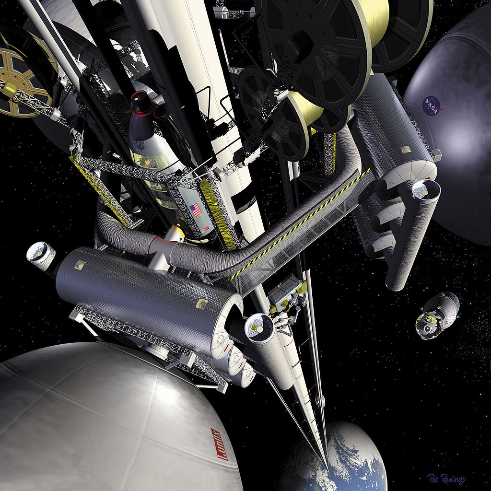

太空电梯
====================

   太空电梯。来自 `NASA <https://commons.wikimedia.org/wiki/File:Nasa_space_elev.jpg>`_ ，为共有领域作品。

要实现太空电梯，其中一个方案是建造一个质心位于地球同步轨道的系统，该系统包括一条下垂到地面的缆绳，这样整个系统的重心会与地面同步旋转，电梯就可以沿着缆绳向上移动，直达太空。

.. figure:: resources/space_elevator/Space_elevator_structural_diagram.png
   :align: center

   太空电梯示意图。来自 `wiki commons <https://en.wikipedia.org/wiki/File:Space_elevator_structural_diagram--corrected_for_scale%2BCM%2Betc--regenerated_as_SVG.svg>`_

历史上第一架太空电梯是使用中国的丝路公司研制的高强度抗拉材料制成的。电梯建成之后，可以直接从位于地球赤道上的地面站乘坐电梯到达太空，相比于当时的火箭，运输成本非常低。有了地球太空电梯的成功经验，火星也建立了一架太空电梯，由于运输成本的变得低廉，这对于火星的发展有着巨大的推进作用。

